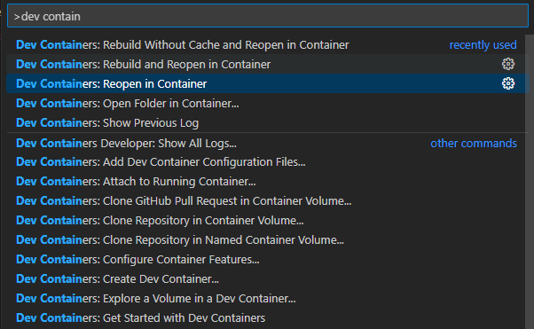
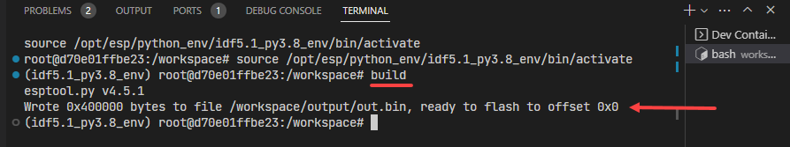
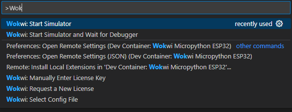

# Running Wokwi Simulations in Vscode

This is an extension of the work done by ....
and adds a few changes 
 - It can run using CodeSpaces
 - It can run without the need to install Docker Desktop (or a similar tool)
   When using docker, the docker base is changed to standard ubuntu, rather than espresif's EDF SKD image. This reduces complexity and avoids errors when the EDF updates.
 - It supports nested folder structure underneath the `./src` folder.
 - The filesystem can be rebuilt, mounted and the emulater restarted with a single keypress (Ctrl-Shift-B) 
 - Adds syntax higlighting and static type checking for MicroPython Esp32 v1.20.0
 - preconfigures serial port using the serial over TCP (rfc2217) 


Work in progress: 
- Support the rp2040 (Pi Pico) 
- Support additional ESP CPUs 
- mpremote over serial over TCP (rfc2217)

## Setup

In order to get this working locally, you'll need to download and install--

- [VSCode](https://code.visualstudio.com/)
- [CodeSpaces](https://github.com/codespaces) You'll need to create a GitHub account and install the Codespaces extension in VSCode. This is needed if you want to run the simulation in the cloud.
- [Docker](https://www.docker.com/) (Optional: needed if you want/need to work in a devcontainer, and it must run on your local machine)

I'm not going to go through the setup process for either of those for the sake of brevity (and my sanity). Both can be downloaded and installed through the company portal. You can also install this on your personal laptop.

## Opening Project

Once you have both of these setup, go ahead and clone this repo to your local filesytem, cd into that folder, and open it up in vscode:

```bash
>>> git clone https://github.com/josverl/wokwi_esp32_micropython.git
>>> cd wokwi_esp32_micropython
>>> code .
```

This repo uses devcontainers to minimize any setup/configuration asked from you. All you have to do after opening up the project in vscode is 
- create a vitual environment(Python), or a devcontainer (if you have docker installed)
- hit Ctrl+Shift+B.

# using a python installation

```bash
>>> python -m venv .venv  # recommended when 
>>> .venv\Scripts\Activate.ps1 # Windows 
>>> source .venv\bin\activate # Linux

>>> pip install -r requirements-dev.txt
```

Then hit Ctrl+Shift+B to build the filesystem and start the simulation.


# Using Devcontainer and Docker 


The first time you do this it will take a couple of minutes as it grabs the latest docker image for the simulator and sets up the container environment. It should take <10seconds to reopen after that.

## Editing Code

All the code + assets that you want to use for the simulation needs to go under the `/src` folder. 

By default, there is a main.py file which is the one that will always run at the start of the simulation. You can split up your code into other files/modules, but in the end, main.py is what needs to orchestrate it all. If you need to reference any other files such as images/sounds, you can also place them in, or under, this folder.

Once you're done adding your files, you'll then need to run the build command.

### Hit Ctrl+Shift+B to build the filesystem and start the simulation.

This command will--

- Build a LittleFS filesystem image with all your files in there
- Merge that filesystem image with the micropython firmware
- (re) Start the simulation

> _Note: You need to run the build command after __each__ time that you edit any of the code, __before__ you rerun the simulation._

Here's an example output for a successful run of the build command --



## Run Simulation

All the code for defining the simulation setup can be found in the `/simulation` folder.

- wokwi.toml -- Sets up the simulation config. Do NOT edit.
- diagram.json -- Sets up the simulation components and connections. The easiest way of getting started here is by using the graphical interface at <https://wokwi.com/> to generate/play around with the different components, then copy over the parts you want to run into the local diagram.json file and restart the simulation.

In order to run the simulation, you'll need to open the command palette back up using Ctrl+Shift+P and select the "Wokwi: Start Simulation" option.



> _Note: The first time you start the simulation, it will ask you to enter a license key but will guide you on how to create a free account and generate the license through the wokwi website._
